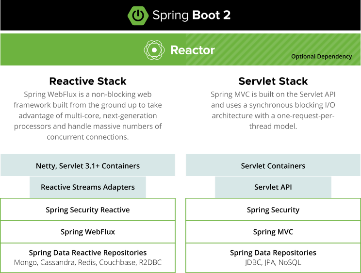

# 响应式编程

## 特性

* 低延迟
* 高吞吐
  
* 反应灵敏
* 弹性
* 可伸缩性
* 消息驱动
* 异步、非阻塞

## 背压的概念

## ReactiveMicroservice
更少的微服务实例，处理更多的并发

## 响应式编程集成通用技术

* MongoDB，Redis
* 通过R2DBC与PostgrelSql MySql等集成
* SpringCloudStream支持以响应式方式访问RabbitMq或Kafka

### 基本概念
Mono： 返回0或1个元素

Flux：返回0-n个元素

