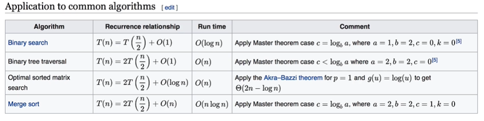
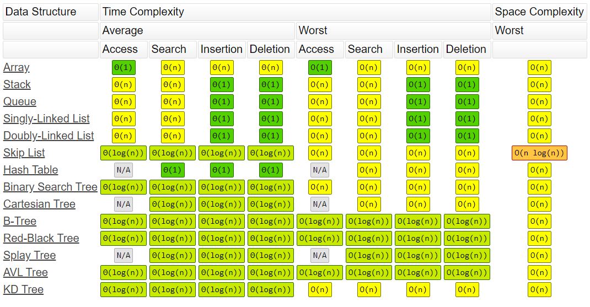
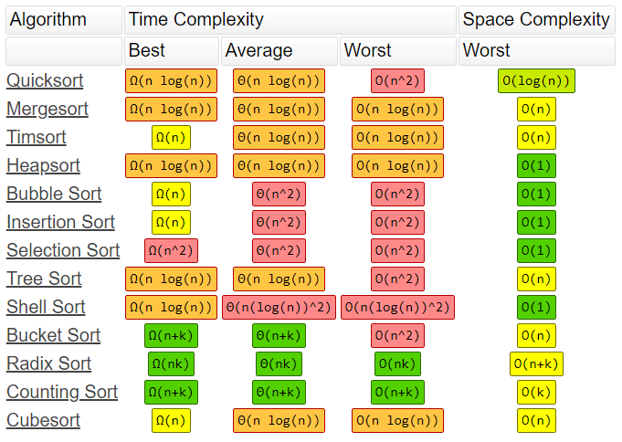

# 数据结构算法

## 基础方法

- 切碎知识点，注重知识点之间的脉络联系
- 刻意练习
- 及时反馈
    1. 主动反馈
    2. 被动反馈

**常见的算法复杂度**

## Common Data Structure Operations

## Array Sorting Algorithms

## Big-O Cheat Sheet

## Array

连续的地址

Access: O(1)

Insert: O(n)

Delete: O(n)

## Linked List

地址不连续

Access: O(n)

Insert: O(1)

Delete: O(1)

## Stack

## Queue

## Heap

最大堆和最小堆的使用

leetcode 703

